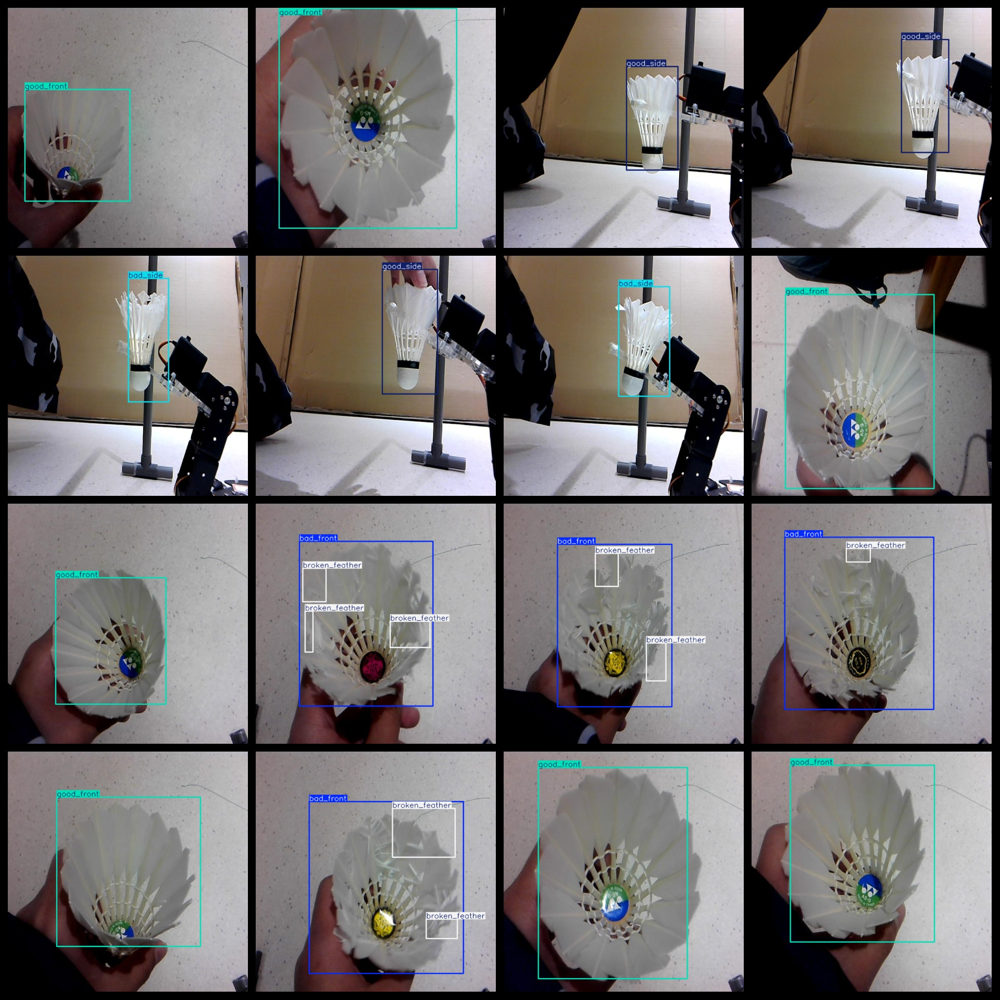
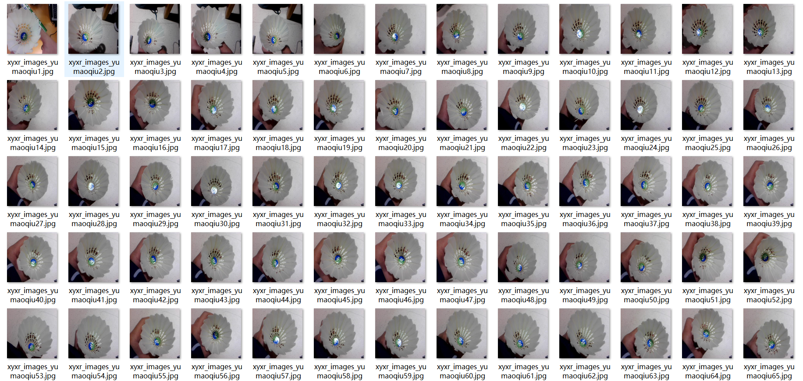

# [Object Detection] Badminton Defect Dataset 1600 images in YOLO+VOC format

[Object Detection] This badminton defect dataset consists of 1600 images in both YOLO and VOC formats, with a large number of enhanced versions. Please be aware when purchasing.

Dataset format: VOC format + YOLO format

The compression package includes three folders, each storing images, xml, and txt files.

In the JPEGImages folder, there are a total of 1600 jpg images.

The Annotations folder contains a total of 1600 xml files.

There are also 1600 txt files in the labels folder.

The number of label categories: 5

Label names: ["bad_front", "bad_side", "broken_feather", "good_front", "good_side"]

The Chinese translation of the label names: front side damage, side damage, broken feather, good front side, good side

Each label's bounding box count (note that the order of categories in the YOLO format does not match this, but is based on the classes.txt file in the labels folder):

- bad_front bounding box count = 401
- bad_side bounding box count = 401
- broken_feather bounding box count = 413
- good_front bounding box count = 400
- good_side bounding box count = 400
- total bounding box count = 2015

Image resolution (pixels): Clear

Is the image enhanced: Yes

Label shape: Rectangular boxes for target detection identification

Important note: There is no warranty regarding the accuracy or reasonableness of the labeled models trained on this dataset. The dataset only provides accurate and reasonable annotations.

## Images

---

Here is a pay link on Stripe (https://buy.stripe.com/3cs8yP7sY87d0vu9AB). Please contact me lonlonago@foxmail.com after funding $89, and I will send you a complete data files, thank you!

